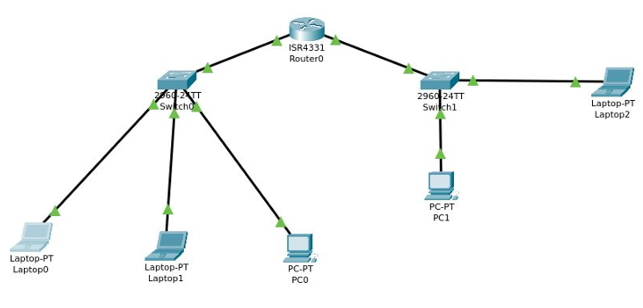

Pratica 2
===

Usando come esempio un pacchetto ICMP usato dal comando ping, tenendo come riferimento l'immagine della rete assegnata per esercizio, in cui LAPTOP PT0 ha assegnato come IP 192.168.100.100, e LAPTOP PT2 ha IP 192.168.200.100, il pacchetto avrà queste modifiche

| percorso | source MAC | destination MAC | source IP | destination IP
| --- | --- | --- | --- | --- |
|PT0 -> router:0 | MAC_PT0 | MAC_router:0 | 192.168.100.100 | 192.168.200.100 | 
| router:1 -> PT2 | MAC_router:1 | MAC_PT2 | 192.168.100.100 | 192.168.200.100 |
| PT2 -> router:1 | MAC_PT2 | MAC_router:1 | 192.168.200.100 | 192.168.100.100 |
| router:0 -> PT0 | MAC_router:0 | MAC_PT0 | 192.168.200.100 | 192.168.100.100 |

Detto a parole, l'indirizzo IP non viene modificato dal router, mentre il MAC address si. Una volta che il pacchetto giunge a destinazione, in questo caso trattandosi di una richiesta ICMP, il destinatario risponde con un pacchetto in cui vengono invertiti gli IP di destinazione e sorgente.
